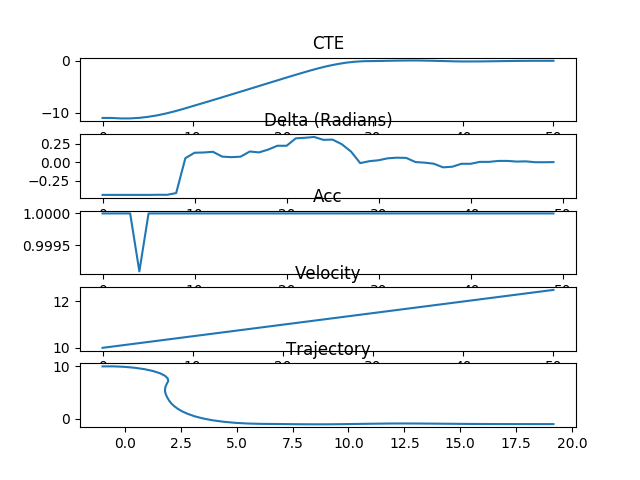

# Solve-MPC-using-PSO

Solve model predictive control using particle swarm optimization.


## Implementation

```sh
git clone git@github.com:gcjyzdd/Solve-MPC-using-PSO.git
cd Solve-MPC-using-PSO
mkdir build
chmod +x test.sh
./test.sh
```

## Demo

**Description**: Apply MPC to a bicycle motion model. The desired trajectory is `y=-1`.

Result is shown as below:

<div style="text-align:center"></div>

Explanation:

* plot 1: cross track error
* plot 2: steering angle input
* plot 3: throtle (acceleration) 
* plot 4: velocity
* plot 5: trajectory of the vechicle

